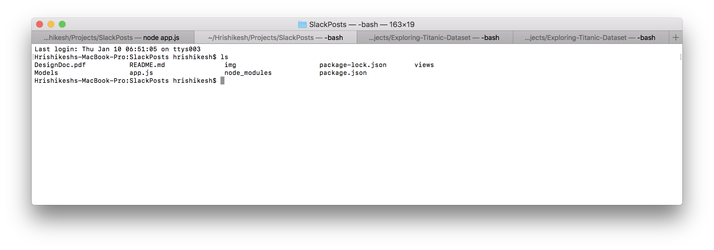
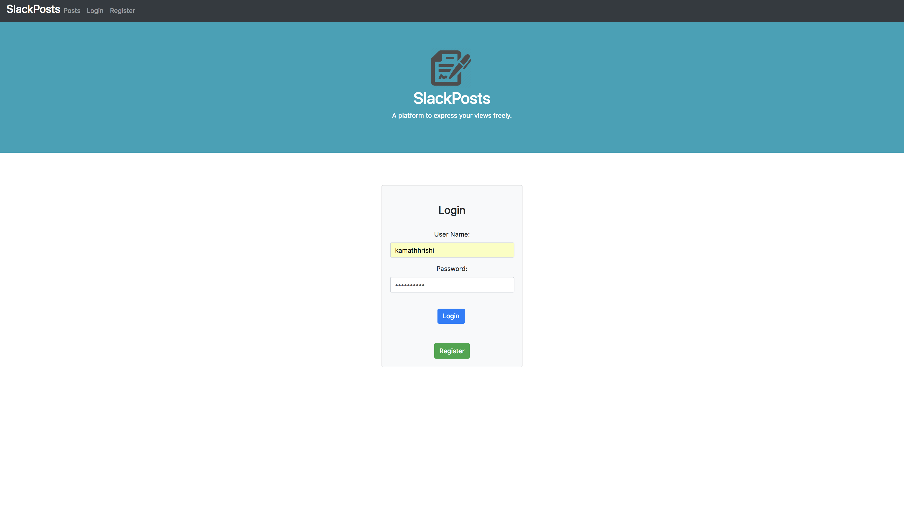
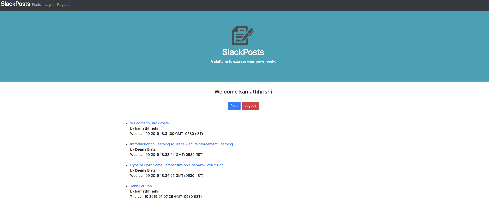

# SlackPosts
Blog application I developed using Nodejs , Express,  Mongoose and MongoDB 

Recommended

Node 8.11 Version 

Other dependencies:

<ul>
  <li>Mongoose</li>
  <li>BodyParser</li>
  <li>express</li>
  <li>MongoDB</li>
</ul>


<h1>Run Application</h1>

```
git clone https://github.com/kamathhrishi/SlackPosts.git
cd SlackPosts
node App.js
```

Go to a Web Browser and run 

```
localhost:3000
```

Ensure a mongodb instance is running with a database named BLOG or change database according to your convienience under this parameter in app.js file. 


```
const Database_Connection='mongodb://localhost:27017/BLOG';
```

<h1>Usage</h1>

1. Having cloned the repository and changed to working directory along with a MongoDB instance running go to terminal and do the following

</img>

2. Go to browser and type the localhost://PORTNUMBER. By dafault it is 3000

```
localhost:3000
```

</img>

3. Click on Register in the Login page and add the appropriate Details with username and title above 5 charecters and password above 8

</img>

4. Go back to login page from navigation bar and enter the registered details 

</img>

5. You will get a Dashboard like this with the posts. If your database collection is empty it will be blank. 

</img>

6. If posts exist. Click on a post and view it.

</img>

7. Go back to Posts link of navigation bar and click on posts.

</img>

8. Write an article of title above 5 charecters and content more than 30 charecters and post.

</img>

9. Go back to posts link on navigation bar. You will notice the article is posted.

</img>

10. Check the post 

</img>

11. Go back to Posts link on navigation bar and click on logout button. 

</img>
